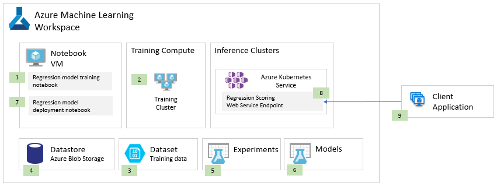

# Regression solution blueprint
The following diagram illustrates a blueprint for a solution that uses regression to predict numeric outcomes (the input of which would be numeric samples). The regressor itself could be built using machine learning or deep learning approaches.

A Jupyter notebook (1) is created within a Notebook VM provisioned within the Azure Machine Learning Workspace. The notebook itself is used to create a training script that will be executed remotely on a Training Cluster (2), provisioning the Training Cluster and scaling it up as necessary. The training script uses the Azure Machine Learning Python SDK to retrieve the training data (a set of flat files) from the Dataset registered (3) with the Workspace and whose connection information (e.g., Storage Account Name and Key) to Azure Storage is defined in the Datastore (4). The supervised model training executes in the context of an Experiment run (5), which logs the training duration and other metadata about the training, collects the performance statistics collected during model evaluation performed in the notebook and relates this metadata with the actual model that is uploaded to the Models registry (6). At the completion of the training, the Training Cluster is scaled down to zero nodes by code executed in the training notebook, saving compute resources while not in use. A new notebook (7), running within the same Notebook VM previously introduced, is used to deploy the model as a web service running in Azure Kubernetes Service (8).  This deployment notebook defines the web service logic that retrieves the model from the Models registry (6), loads the model into memory and uses the loaded model for inferencing against every request for classification. This logic, along with the Conda and PIP dependencies are packaged into a Docker Container that is deployed by the notebook to the Azure Kubernetes Service (8) using the Azure Machine Learning Python SDK. Once deployed, the scoring web service handles the regression against input samples arriving from the client application (9) in the form of HTTP requests.